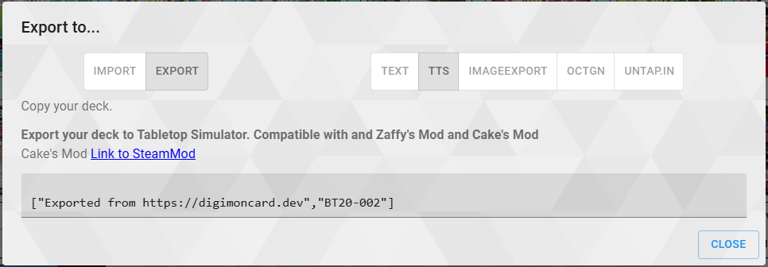
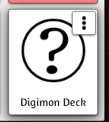

# Deck Generator Tool for Digimon TCG Tabletop Simulator games

## Instructions

Go to digimoncard.dev 
Create your deck in the deck editor, then export to TTS. 
 
Any other deckbuilder that exports in the same format is also a valid alternative.

Copy and paste the export text as written into the program when prompted to. 
Optional: You can use alt arts by manually adding "_P1", "_P2", etc after the appropriate card IDs.

Then copy and paste the outputted file directly into your TTS saved objects folder (On Windows this is located at Documents/My Games/Tabletop Simulator/Saves/Saved Objects). 
Load it into a lobby as you would any other item. 

Optional: You can use any image you want as the in game thumbnail for your deck, by placing a .png into the Saved Objects folder with the same name as your .json file

## TODO

- Unreleased cards 
    The images are taken from the official Digimon TCG website and thus can only use cards currently hosted on the site. 
- Parallel Arts 
    Due to how digimoncard.dev exports cards, another method is needed to automatically identify parallel arts for cards